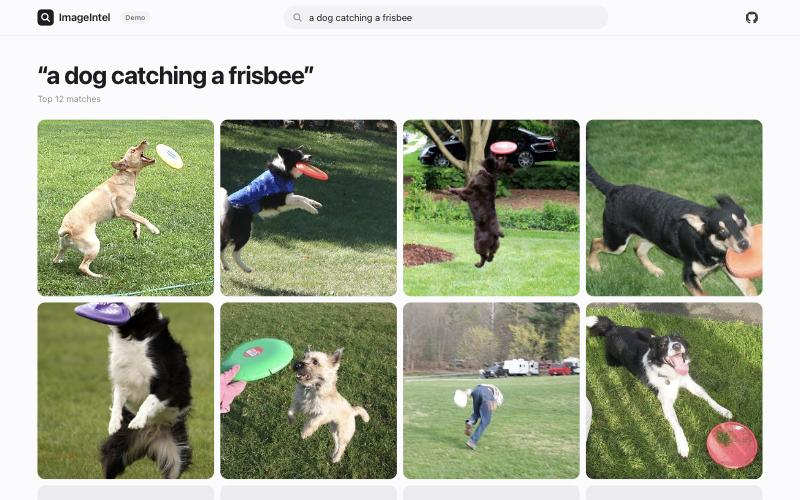
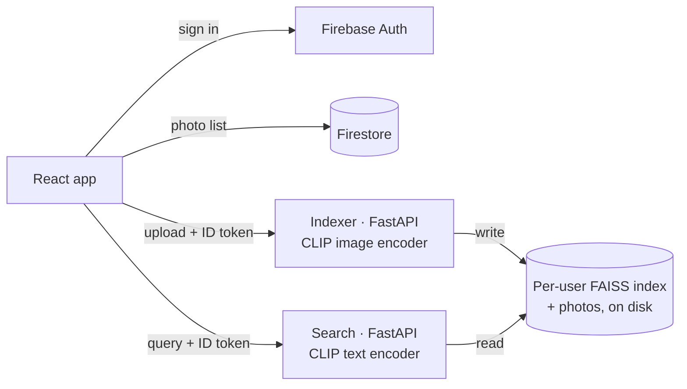
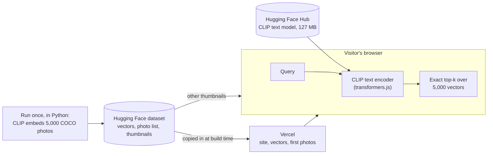

# Semantic Image Search

Search photos by describing them ("a dog catching a frisbee") instead of by tags or file names.

**Live demo: https://semantic-image-search-lime.vercel.app**. It searches 5,000 photos from COCO, entirely in your browser.



## How it works

OpenAI's pretrained [CLIP](https://github.com/openai/CLIP) model (ViT-B/32, not fine-tuned) turns an image or a piece of text into a 512-number vector, placing a photo and a description of it close together. Each photo is embedded once, when it is added. A search embeds the query and returns the photos whose vectors are closest: an exact search by cosine similarity, which takes under a millisecond for 5,000 photos.

## Architecture

**Full app**: sign in, upload your own photos, search them. It runs locally with Docker.



Both services take the user from the verified Firebase token, never from the request. Each user has their own index file, written atomically under a per-user lock. Photos are served as re-encoded copies, so their location data (EXIF) never leaves the server.

**Public demo**: no server at all.



The example searches are ranked at build time, so they need no model. A typed search downloads the text model once, and the browser caches it. The browser's model gives the same results as the Python one: checked on 1,000 captions, it gets the same Recall@5 (55.0%).

## Results

COCO val2017: 5,000 images, 25,014 human-written captions. Each caption is used as a query for its own photo.

| Text to image | R@1 | R@5 | R@10 |
|---|---|---|---|
| CLIP ViT-B/32 | 30.4% | 54.8% | 66.1% |

R@K is the share of captions whose photo is in the top K results. Search takes 0.29 ms over 5,000 photos, and 8.7 ms end to end including embedding the query (Apple M1 Pro). Full tables: [`backend/bench/results/`](backend/bench/results/coco_val2017.md).

## Stack

Python, PyTorch (open_clip), FAISS, FastAPI, Docker · React, TypeScript, Vite, transformers.js · Firebase Auth and Firestore · Vercel, Hugging Face

## Running it

Backend (indexer on port 8001, search on 8002):

```bash
docker compose up --build
```

Frontend, in another terminal:

```bash
cd frontend
npm ci
npm run dev
```

Then open http://localhost:5173. Settings are in [`frontend/.env.example`](frontend/.env.example). Benchmarking, tests and rebuilding the demo's data are covered in [`backend/README.md`](backend/README.md).

## Layout

| Path | Contents |
|---|---|
| `backend/common/` | CLIP encoder, image decoding, per-user index store, token auth |
| `backend/services/` | The indexer and search services |
| `backend/bench/` | COCO benchmark: recall, latency, scaling |
| `backend/demo/` | Builds and publishes the demo's data |
| `frontend/` | The React app; `src/demo/` is the in-browser search |
| `docs/decisions/` | Design notes: why each part is built the way it is |
